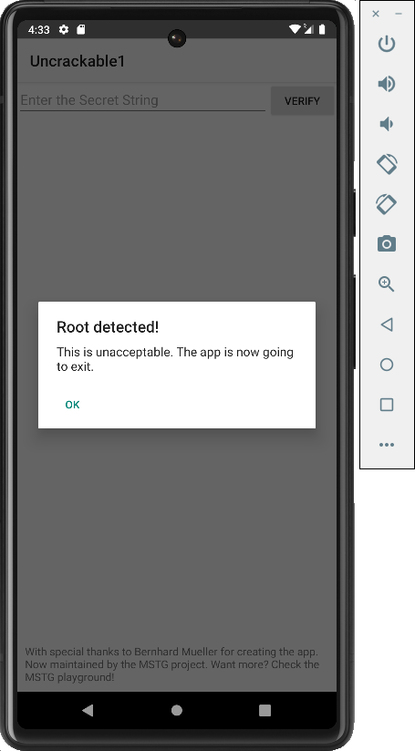
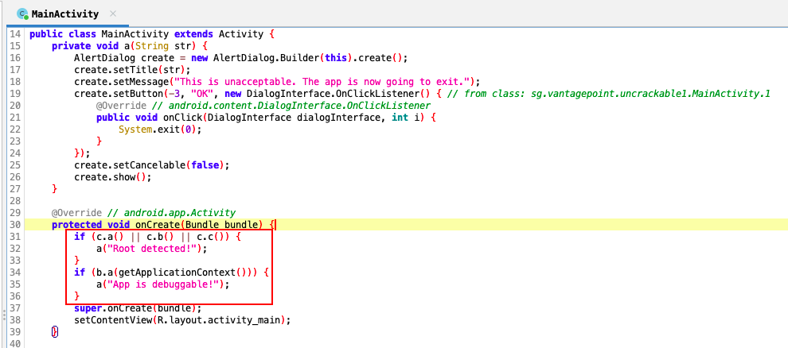

# Android UnCrackable L1

> Application designed for practicing dynamic analysis with Frida, focusing on bypassing Root/Debug detections and hooking cryptographic functions to extract sensitive keys at runtime.

**TL;DR:** [Frida script with solution for this exercise](uncrackable1.js)

## Root And Debug Detection

We will first start by installing the application using the `ADB`:

```bash
adb install UnCrackable-Level1.apk
```

Since the application is run on an emulator, upon launch it displays the following view warning users that the device is rooted:

{ width="400" style="display:block; margin:0 auto;" }


So let's check its source code. To do so, we will need to decompile its source code with [JADX](https://github.com/skylot/jadx). This can be run from the command line with the following command:

```bash
jadx-gui UnCrackable-Level1.apk
```

Once loaded, we navigate to the application's launcher class `MainActivity.class`.

Checking its code it is confirmed that the application not only checks if it's being run on a rooted device, but it also checks if the app is running in debug mode:

{ width="600" style="display:block; margin:0 auto;" }

So, to bypass these controls, we will have to hook all these methods with Frida and make them return `false`:

{ width="500" style="display:block; margin:0 auto;" }


{ width="500" style="display:block; margin:0 auto;" }

The Frida script to bypass these checks will look like:

```javascript
function rootChecks(){
    // Root checks bypass
    var rootCheckClass = Java.use("sg.vantagepoint.a.c");

    rootCheckClass.a.implementation = function(){
        console.log("Root check bypassed!");
        return false;
    }

    rootCheckClass.b.implementation = function(){
        console.log("Root check bypassed!");
        return false;
    }

    rootCheckClass.c.implementation = function(){
        console.log("Root check bypassed!");
        return false;
    }
}

function debugChecks() {
    // Debug checks bypass
    var debugCheckClass = Java.use("sg.vantagepoint.a.b");
    debugCheckClass.a.implementation = function() {
        console.log("Debug check bypassed!");
        return false;
    }
}

Java.perform(function(){
    rootChecks();
    debugChecks();
});
```


## Extract Secret Key

Let's add the logic that extracts the secret key required by the application:

```javascript
function extractSecretKey(){
    var decryptClass = Java.use("sg.vantagepoint.a.a")
    decryptClass.a.implementation = function (bArr1, bArr2) {
        // Let the original method finish and get the byte array
        var retValue = this.a(bArr1, bArr2);

        // Since the decryption method returns a byte array, we need to cast it to a String object
        var stringClass = Java.use("java.lang.String");
        var decryptedString = stringClass.$new(retValue);
        console.log("Secret: " + decryptedString);
        
        // IMPORTANT: Return the original byte array so the app keeps working
        return retValue;
    }
}
```

## Final Script

The final script will look like:

```javascript
function rootChecks(){
    // Root checks bypass
    var rootCheckClass = Java.use("sg.vantagepoint.a.c");

    rootCheckClass.a.implementation = function(){
        console.log("Root check bypassed!");
        return false;
    }

    rootCheckClass.b.implementation = function(){
        console.log("Root check bypassed!");
        return false;
    }

    rootCheckClass.c.implementation = function(){
        console.log("Root check bypassed!");
        return false;
    }
}

function debugChecks() {
    // Debug checks bypass
    var debugCheckClass = Java.use("sg.vantagepoint.a.b");
    debugCheckClass.a.implementation = function() {
        console.log("Debug check bypassed!");
        return false;
    }
}

function extractSecretKey(){
    var decryptClass = Java.use("sg.vantagepoint.a.a")
    decryptClass.a.implementation = function (bArr1, bArr2) {
        // Let the original method finish and get the byte array
        var retValue = this.a(bArr1, bArr2);

        // Since the decryption method returns a byte array, we need to cast it to a String object
        var stringClass = Java.use("java.lang.String");
        var decryptedString = stringClass.$new(retValue);
        console.log("Secret: " + decryptedString);
        
        // IMPORTANT: Return the original byte array so the app keeps working
        return retValue;
    }
}

Java.perform(function(){
    rootChecks();
    debugChecks();
    extractSecretKey();
});
```