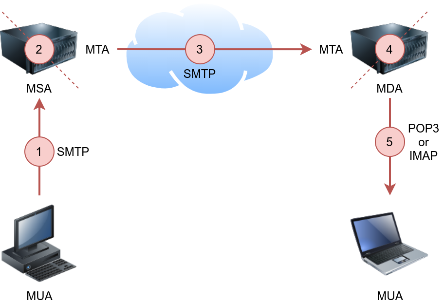

# Network Fundamentals

## ICMP

It is used for error reporting and diagnostics. Common ICMP messages include echo request and echo reply.

### Ping

```
ping -c 10 MACHINE_IP
```

## DHCP

It is often used in conjuntion with IP to dynamically assing IP addresses to devices on a network.


## Traceroute

The traceroute command traces the route taken by the packets from your system to another host.

On Linux and macOS, the command to use is `traceroute MACHINE_IP`, and on MS Windows, it is `tracert MACHINE_IP`.

## Protocols and Servers

| Protocol | TCP Port | Application(s)                  | Data Security |
|----------|----------|---------------------------------|---------------|
| FTP      | 21       | File Transfer                   | Cleartext     |
| FTPS     | 990      | File Transfer                   | Encrypted     |
| HTTP     | 80       | Worldwide Web                   | Cleartext     |
| HTTPS    | 443      | Worldwide Web                   | Encrypted     |
| IMAP     | 143      | Email (MDA)                     | Cleartext     |
| IMAPS    | 993      | Email (MDA)                     | Encrypted     |
| POP3     | 110      | Email (MDA)                     | Cleartext     |
| POP3S    | 995      | Email (MDA)                     | Encrypted     |
| SSH      | 22       | Remote Access and File Transfer | Encrypted     |
| SMTP     | 25       | Email (MTA)                     | Cleartext     |
| SMTPS    | 465      | Email (MTA)                     | Encrypted     |
| Telnet   | 23       | Remote Access                   | Cleartext     |


## Other commonly used ports

| Port  | Service                       |
|-------|-------------------------------|
| 139   | Older SMB versions            |
| 445   | SMB                           |
| 3389  | Remote Desktop Protocol (RDP) |
| 2206  | MySQL Database                |
| 8080  | HTTP alternative port         |
| 27017 | MongoDB Database              |


### Telnet

The Telnet protocol is an application layer protocol used to connect to a virtual terminal of another computer. Using Telnet, a user can log into another computer and access its terminal (console) to run programs, start batch processes, and perform system administration tasks remotely.

Knowing that telnet client relies on the TCP protocol, Telnet can be used to connect to any service and grab its banner. 

Using `telnet MACHINE_IP PORT`, you can connect to any service running on TCP and even exchange a few messages unless it uses encryption.

Let’s say we want to discover more information about a web server, listening on port 80:
- Connect to the server at port 80: `telnet MACHINE_IP 80`
- Issue a get request: `GET / HTTP/1.1`
- Input some value for the host: `host: example`
- Hit enter **twice**

### File Transfer Protocol (FTP)

File Transfer Protocol (FTP) was developed to make the transfer of files between different computers with different systems efficient.

Since FTP also sends and receives data as cleartext; Telnet (or Netcat) can be used to communicate with an FTP server and act as an FTP client:
- Connect to an FTP server using a Telnet client: `telen MACHINE_IP 21`
- Provide the username: `USER <username>`
- Provided the password: `PASS <pass>`

Using `ftp` command: `ftp -p HOST PORT`

#### Modes
All commands will be sent over the control channel. Once the client requests a file, another TCP connection will be established between them.

- **Active**: In the active mode, the data is sent over a separate channel originating from the FTP server’s port 20.
- **Passive**: In the passive mode, the data is sent over a separate channel originating from an FTP client’s port above port number 1023.

#### Commands
- **STAT**: provides some additional information.
- **SYST**: shows the System Type of the target.
- **PASV**: switches the mode to passive.
- **TYPE A**: switches the file transfer mode to ASCII.
- **TYPE I**: switches the file transfer mode to binary.


### Post Office Protocol 3 (POP3)
Post Office Protocol version 3 (POP3) is a protocol used to download the email messages from a Mail Delivery Agent (MDA) server:

{ width="500" style="display:block; margin:0 auto;" }

**POP3 default port number is 110.**

Connect to POP3 client using telnet:
- Telnet command: `telnet MACHINE_IP 110`
- `USER <username>`
- `PASS <pass>`

### Commands
- **STAT**: a positive response to STAT has the format +OK nn mm, where nn is the number of email messages in the inbox, and mm is the size of the inbox in octets (byte).
- **LIST**: provides a list of new messages on the server.
- **RETR 1**: retrieves the first message in the list.


### Internet Message Access Protocol (IMAP)

**IMAP default port number is 143.**

Connect to POP3 cient using telnet:
- Telnet command: `telnet MACHINE_IP 143`
- Authenticate using: `LOGIN username password` 
> IMAP requires each command to be preceded by a random string to be able to track the reply. So we can add c1, then c2, and so on. 
