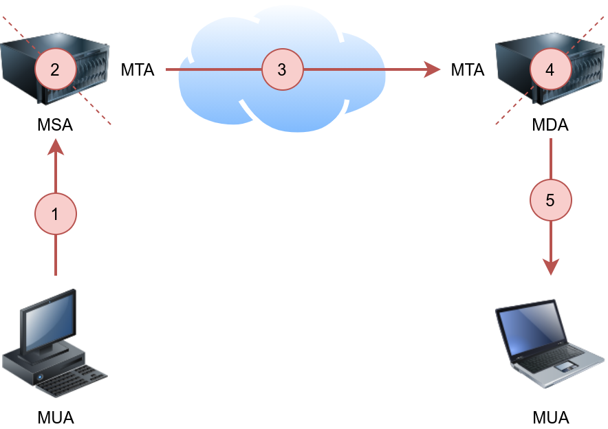

# Simple Mail Transfer Protocol (SMTP)

Email delivery over the Internet requires the following components:

- Mail Submission Agent (MSA)
- Mail Transfer Agent (MTA)
- Mail Delivery Agent (MDA)
- Mail User Agent (MUA)

{ width="500" style="display:block; margin:0 auto;" }

Simple Mail Transfer Protocol (SMTP) is used to communicate with an MTA server. Because SMTP uses cleartext, where all commands are sent without encryption, we can use a basic Telnet client to connect to an SMTP server and act as an email client (MUA) sending a message.

**SMTP server listens on port 25 by default. However, it can also run on TCP port 465 and 587.**

## Send an email using Telnet

```bash
# Connect using telnet
telnet MACHIE_IP 25

# Issue a HELO message: 
HELO attacker.xyz

# Indicate the sender: 
mail from:admin@attacker.xyz
# Indicate the recipient: 
rcpt to:root@openmailbox.xyz
data
Subject: Hi
Hello,
This is a fake email.
.
# Issue <CR><LF>.<CR><LF> (or Enter . Enter to put it in simpler terms)
```

## Send an email using sendemail command

```bash
sendemail -f admin@attacker.xyz -t root@attacker.xyz -s TARGET_HOST -u Fakemail -m "Hi, this is a fake email" -o tls=no
```

## Enumeration

### Metasploit Auxiliary Modules

**auxiliary/scanner/smtp/smtp_version**

```bash
use auxiliary/scanner/smtp/smtp_version

set RHOSTS TARGET_IP

run
```

**auxiliary/scanner/smtp/smtp_enum**

It performs user enumeration.

```bash
use auxiliary/scanner/smtp/smtp_enum

set RHOSTS TARGET_IP

set USER_FILE USERS_WORDLIST
# Example: /usr/share/metasploit-framework/data/wordlist/unix_users.txt

run
```

### Netcat

```bash
nc TARGET_IP PORT

# Verify if a user exists
VRFY user@domain
```

### smtp-user-enum

```bash
smtp-user-enum -U WORDLIST -t TARGET_IP
```